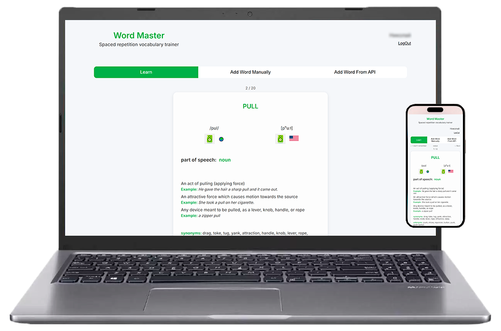
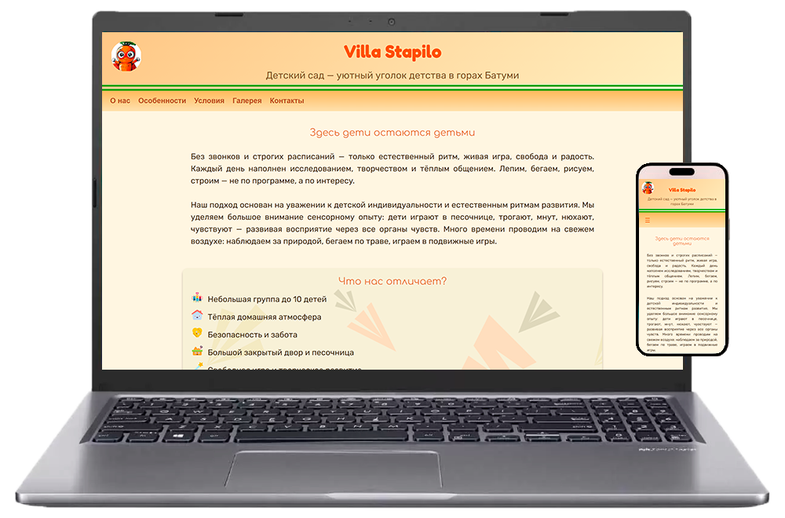
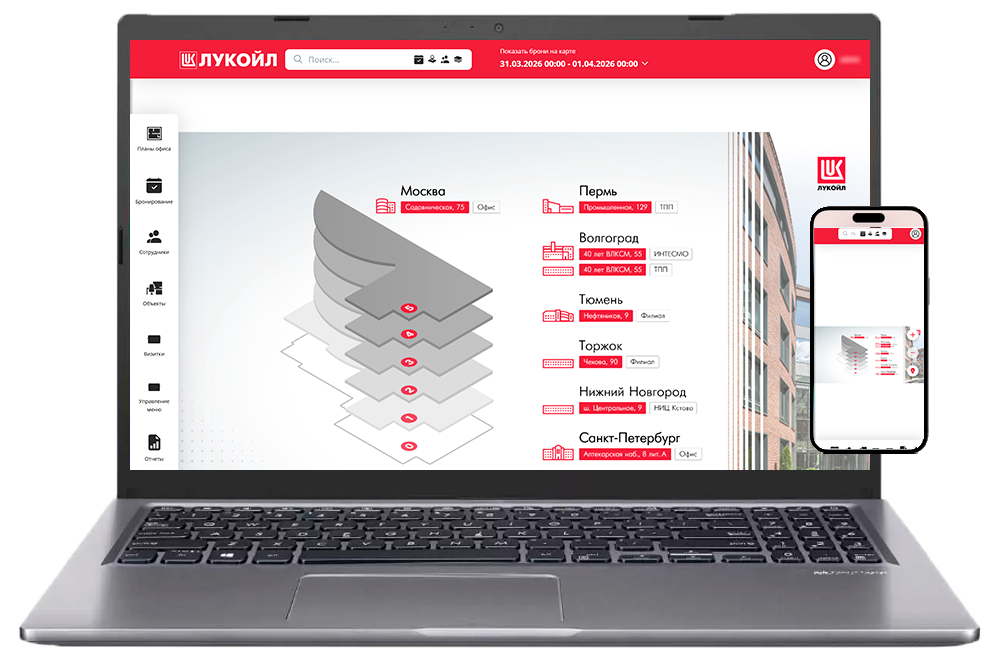
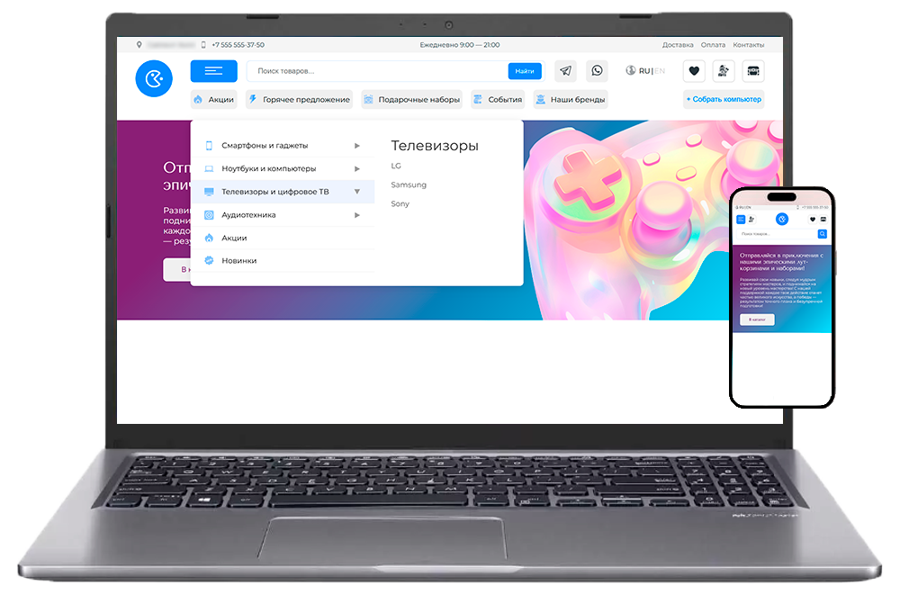
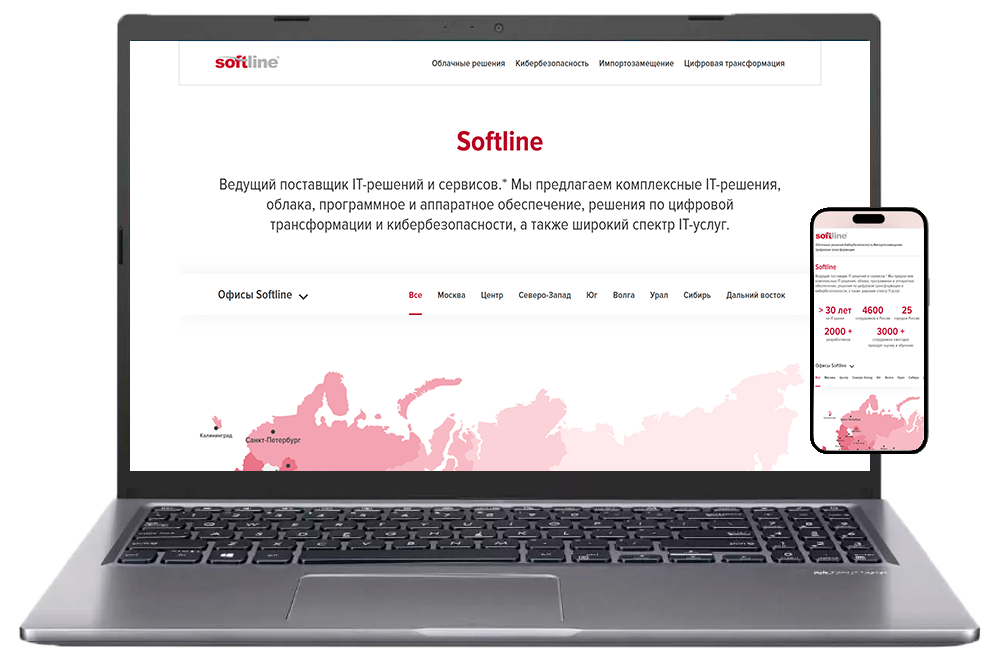

# Привет! Я Николай 👋

Я Fullstack-разработчик, специализируюсь на React и Node.js экосистеме.  
Разрабатываю SPA-приложения с авторизацией, REST API и базами данных.  
Люблю архитектуру, чистый код и продумывание UX.

На этой странице представлено мое портфолио и мои навыки.

---

## 🚀 Проекты

### **📖 Dictionary**
Приложение позволяет авторизованным пользователям добавлять английские слова в свой словарь для изучения и повторения.

- **Стек технологий:** TypeScript, React, Vite, Redux Toolkit, React Router, MongoDB, Nest.js, Node.js
- **Сайт:** [Dictionary App](https://dictionary-app-eight-gray.vercel.app/)
- **Тестовый доступ:** `name - test`, `password - qwerty`

  

### **🏫 Villa Stapilo**
Сайт частного детского сада с информацией о направлениях и условиях.

- **Стек технологий:** TypeScript, React, Vite, CSS Modules
- **Сайт:** [Villa Stapilo](https://kindergartenvillastapilo.vercel.app/)

  

---

## 🖼 Другие проекты

  
  

  
  

## 🧰 Навыки

### 🎨 Frontend

### ⚙️ Backend & API

### 🗄 Databases

### 🧰 Tools & DevOps

---

## 📫 Контакты

- GitHub: [@NikolaJJMusatov](https://github.com/NikolaJJMusatov)
- LinkedIn: [Ссылка на LinkedIn](https://www.linkedin.com/in/nikolai-musatov-4447a9360/)
- Email: [musatovnikolajj@rambler.ru](mailto:musatovnikolajj@rambler.ru)
